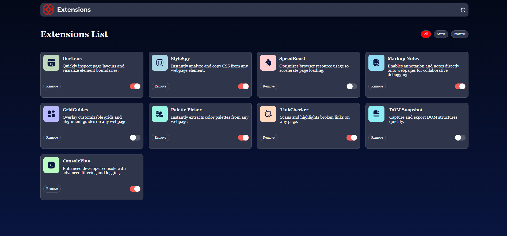

# Frontend Mentor - Browser extensions manager UI solution

This is a solution to the [Browser extensions manager UI challenge on Frontend Mentor](https://www.frontendmentor.io/challenges/browser-extension-manager-ui-yNZnOfsMAp). Frontend Mentor challenges help you improve your coding skills by building realistic projects.

## Table of contents

- [Frontend Mentor - Browser extensions manager UI solution](#frontend-mentor---browser-extensions-manager-ui-solution)
  - [Table of contents](#table-of-contents)
  - [Overview](#overview)
    - [The challenge](#the-challenge)
    - [Screenshot](#screenshot)
    - [Links](#links)
  - [My process](#my-process)
    - [Built with](#built-with)
    - [Continued development](#continued-development)
    - [Useful resources](#useful-resources)
  - [Author](#author)

**Note: Delete this note and update the table of contents based on what sections you keep.**

## Overview

### The challenge

Users should be able to:

- Toggle extensions between active and inactive states
- Filter active and inactive extensions
- Remove extensions from the list
- Select their color theme
- View the optimal layout for the interface depending on their device's screen size
- See hover and focus states for all interactive elements on the page

### Screenshot



### Links

- Solution URL: [Add solution URL here](https://your-solution-url.com)
- Live Site URL: [Add live site URL here](https://your-live-site-url.com)

## My process

### Built with

- Semantic HTML5 markup
- CSS custom properties
- Flexbox
- CSS Grid
- Mobile-first workflow
- [React](https://reactjs.org/) - JS library
- [Styled Components](https://styled-components.com/) - For styles

```js
const handleFilterChange = (filter: string) => {
  setFilterProp(filter);
};
const AllActive = toggleState.filter((item) => item.isActive);
const AllInActive = toggleState.filter((item) => !item.isActive);
const updateActiveState = (nameOf: string, isActive: boolean) => {
  setToggleState(
    toggleState.map((item) => {
      if (item.name === nameOf) return { ...item, isActive: isActive };
      return item;
    })
  );
};
const deleteitemhandler = (nameOf: string) => {
  setToggleState(toggleState.filter((item) => item.name !== nameOf));
};
```

If you want more help with writing markdown, we'd recommend checking out [The Markdown Guide](https://www.markdownguide.org/) to learn more.

**Note: Delete this note and the content within this section and replace with your own learnings.**

### Continued development

Use this section to outline areas that you want to continue focusing on in future projects. These could be concepts you're still not completely comfortable with or techniques you found useful that you want to refine and perfect.

**Note: Delete this note and the content within this section and replace with your own plans for continued development.**

### Useful resources

- [React docs](https://react.dev/) - This helped me for XYZ reason. I really liked this pattern and will use it going forward.

## Author

- Website - [Natan](https://www.npndesign.com/)
- Frontend Mentor - [@henrix494](https://www.frontendmentor.io/profile/henrix494)
- GITHUB - [@henrix494](https://github.com/henrix494)
